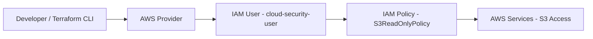

# Cloud Engineering & Security Portfolio

## Overview
Hands-on cloud engineering portfolio focused on AWS infrastructure, identity security, and infrastructure-as-code.

---

## Projects

### 1. IAM Security Baseline (Terraform)

- AWS IAM user and least-privilege policy  
- Infrastructure-as-code using Terraform  

#### Architecture

### 2. VPC Network Architecture

- VPC with public/private subnets
- Basic routing and network segmentation

### 3. CI/CD Pipeline
- GitHub Actions Terraform validation workflow

---

## Tools
AWS | Terraform | GitHub Actions | IAM | Cloud Networking

---

## Focus Areas
- Cloud Security Architecture
- Identity & Access Management
- Infrastructure as Code
- DevOps Security