# Cloud Engineering & Security Portfolio

---

Hi! Welcome to my Cloud Engineering Portfolio. I Built this to demonstrate hands on AWS and Terraform skills to prospective employers. Every resource here was actually deployed and tested in a live AWS account. with a focus on identity security, network segmentation, compute provisioning, and CI/CD automation. Built to mirror real-world cloud engineering patterns using IaC and security-first design.

## System Architecture Overview

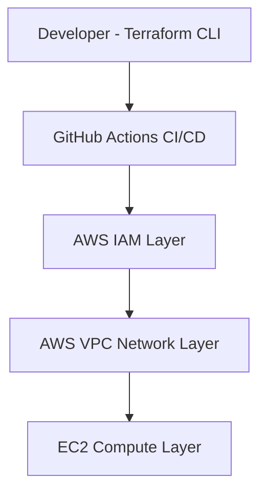

**Core Engineering Principles**
- Infrastructure as Code (fully reproducible AWS environments)
- Least-Privilege Identity Access (IAM scoped permissions)
- Network Segmentation (public vs private subnet isolation)
- Secure Compute Provisioning (controlled EC2 deployment)
- Shift-Left Validation (CI/CD Terraform checks before deployment)

---

## Projects

---

### 1. IAM Security Baseline (Terraform)

**Overview**
Designed and deployed a least privilege IAM model using Terraform to enforce secure identity provisioning in AWS. The architecture explicitly restricts access to S3 read-only operations, eliminating administrative access and wildcard permissions to follow least privilege security principles.

**Architecture**

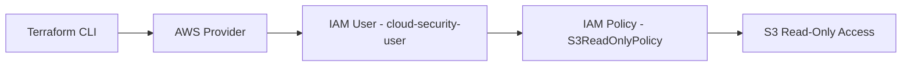

**Resources Provisioned**
- IAM User: cloud-security-user
- IAM Policy: S3ReadOnlyPolicy (explicit S3 GetObject + ListBucket access)
- IAM Policy Attachment (User to Policy binding)

**Deployment Workflow**
- terraform init — provider initialization and plugin resolution
- terraform plan — change validation and drift detection
- terraform apply — infrastructure provisioning in AWS

**Evidence of Deployment**

Terraform Execution:

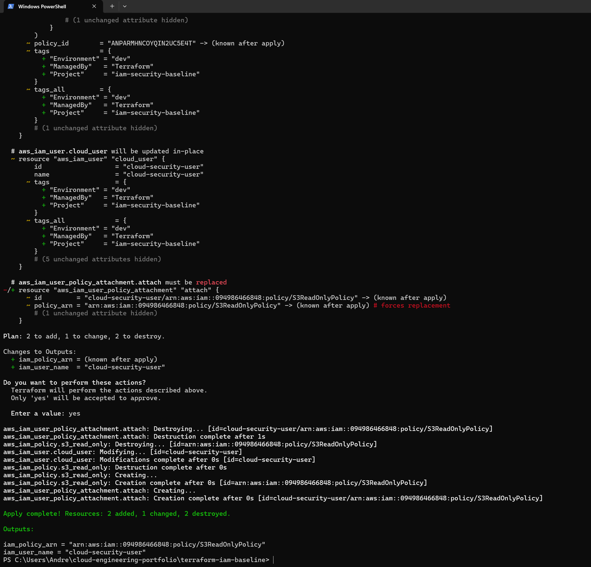

IAM User Created:

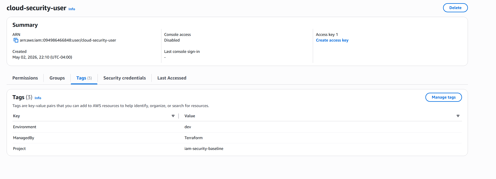

IAM Policy Definition:

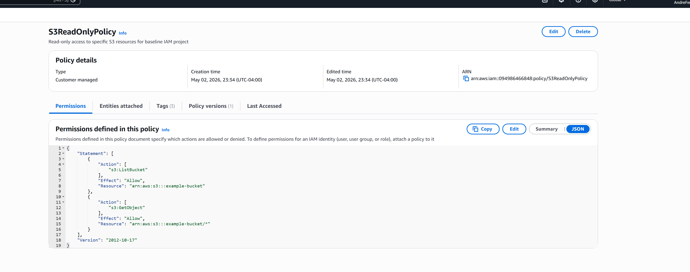

**Security Design Principles**
- Least privilege IAM access enforced at identity layer
- Explicit resource-level permission scoping (no wildcards)
- No administrative privileges assigned
- Infrastructure as Code enforced identity provisioning
- Fully reproducible and auditable deployments

---

### 2. VPC Network Architecture (Terraform)

**Overview**
Designed and deployed a modular AWS VPC network using Terraform to demonstrate secure cloud networking principles, including subnet segmentation, routing control, and workload isolation.

**Architecture**

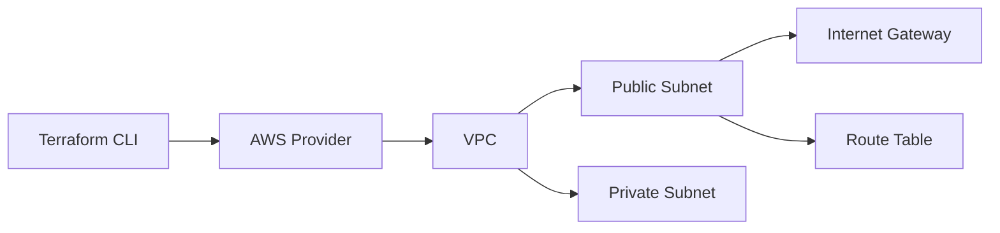

**Resources Provisioned**
- VPC with custom CIDR block
- Public subnet (internet-facing tier)
- Private subnet (isolated workload tier)
- Internet Gateway
- Route table associations

**Deployment Workflow**
- terraform init — provider initialization
- terraform plan — network configuration validation
- terraform apply — infrastructure provisioning

**Evidence of Deployment**

Terraform Execution:

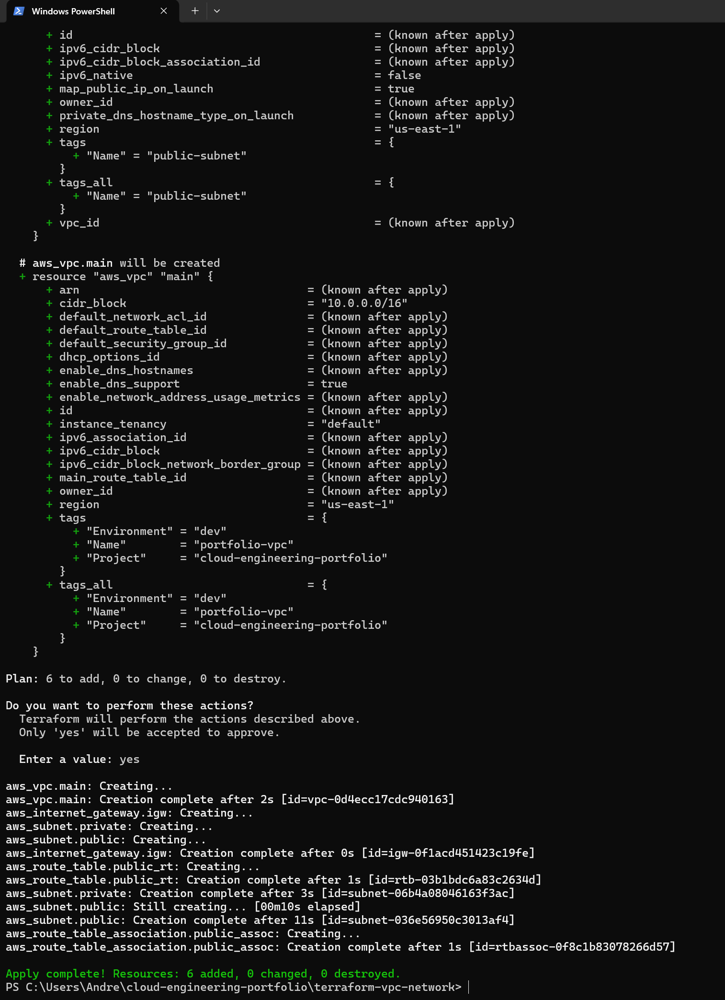

VPC Configuration:

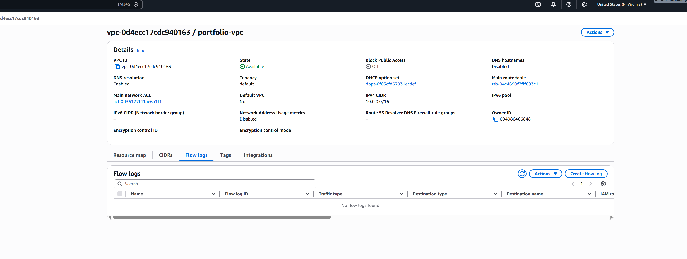

Subnet Configuration:

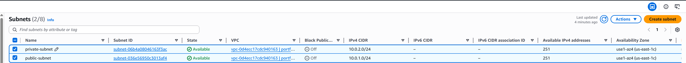

Route Table Configuration:

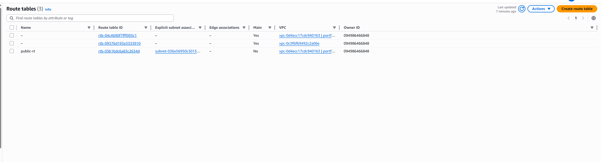

**Security Design Principles**
- Network segmentation between public and private tiers
- Explicit routing control (no implicit internet access)
- Private subnet isolation from direct inbound exposure
- Controlled internet ingress via public subnet only
- Infrastructure as Code enforced network consistency

---

### 3. CI/CD Pipeline (Terraform Validation)

**Overview**
Implemented a GitHub Actions CI pipeline to automate Terraform validation checks on every commit and pull request. This pipeline enforces shift-left validation, ensuring infrastructure issues are detected before deployment.

**Pipeline Flow**

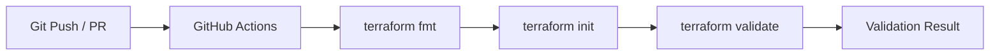

**Pipeline Stages**
- terraform fmt — formatting consistency enforcement
- terraform init — provider and dependency resolution
- terraform validate — configuration correctness validation

**Evidence of Execution**

CI Pipeline Run:

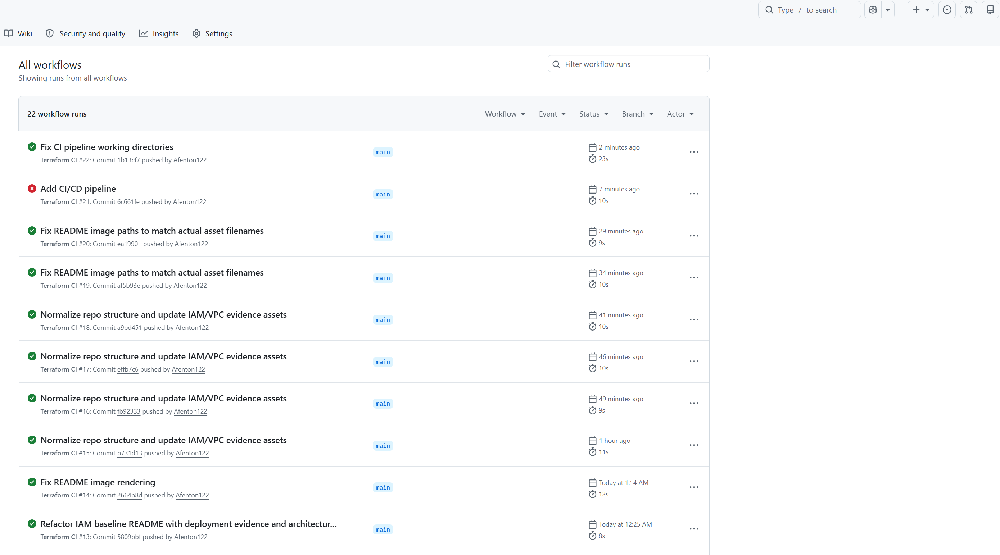

Successful Validation:

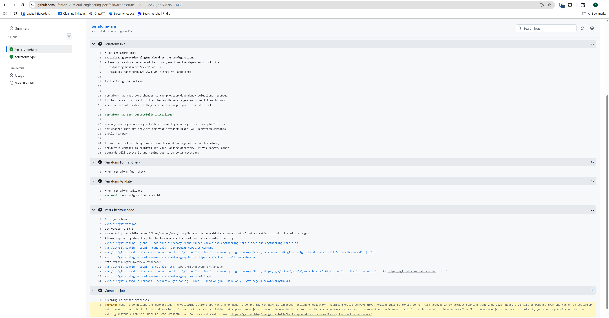

**Design Principles**
- Shift-left validation for infrastructure safety
- Automated enforcement of Terraform standards
- Stateless execution in ephemeral CI environments
- Consistent validation across all contributors
- Reproducible infrastructure testing pipeline

---

### 4. Compute Layer (EC2 Baseline - Terraform)

**Overview**
Provisioned a secure by default EC2 compute instance using Terraform to demonstrate workload layer infrastructure provisioning within AWS. This completes the core AWS infrastructure triangle of identity, networking, and compute.

**Architecture**

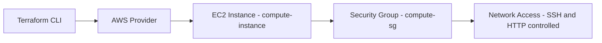

**Resources Deployed**
- EC2 Instance (t2.micro)
- Security Group (SSH and HTTP access control)
- Default VPC subnet placement

**Deployment Workflow**
- terraform init — provider initialization
- terraform plan — validation of compute resources
- terraform apply — EC2 provisioning in AWS

**Evidence of Deployment**

Terraform Apply Output:

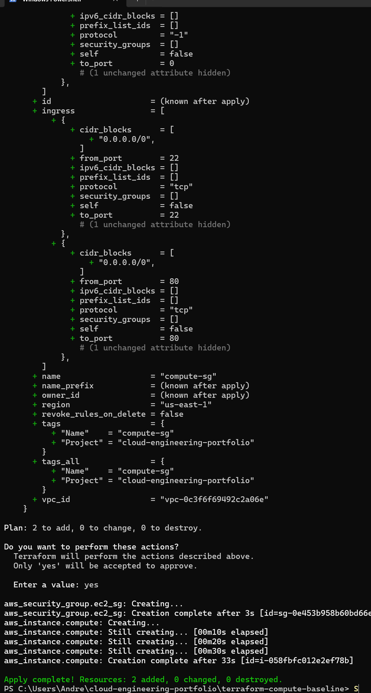

EC2 Instance Running:

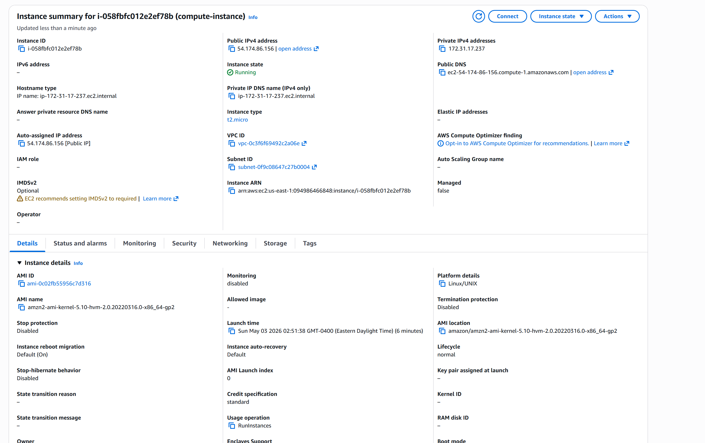

Security Group Configuration:

**Security Design Principles**
- Controlled inbound access via Security Groups
- Minimal compute footprint (t2.micro)
- No open administrative access beyond SSH
- Infrastructure-as-Code enforced provisioning
- Reproducible compute deployment model

---

## Production Considerations and Engineering Tradeoffs

This project is intentionally simplified to demonstrate core AWS architecture patterns while maintaining cost efficiency and reproducibility.

In a production environment, the following enhancements would be applied:

**Security Enhancements**
- IAM roles for EC2 instead of direct policy attachments
- MFA enforcement for privileged actions
- Centralized secrets management via AWS Secrets Manager or SSM Parameter Store

**Infrastructure Hardening**
- Remote Terraform state (S3 backend with DynamoDB locking)
- VPC fully isolated from default network
- Private subnet compute workloads with NAT gateway egress control

**Operational Improvements**
- Multi environment separation (dev, staging, production)
- Enhanced logging via CloudWatch and centralized monitoring
- CI/CD promotion pipelines with approval gates

---

## Summary

This repository demonstrates end to end AWS infrastructure engineering capability across identity, network, compute, and automation layers using Terraform and GitHub Actions.

---

## Tools
AWS | Terraform | GitHub Actions | IAM | Cloud Networking

---

## Focus Areas
- Cloud Security Architecture
- Identity & Access Management (IAM)
- Infrastructure as Code (IaC)
- Secure Cloud Networking
- CI/CD Automation and Validation Pipelines
