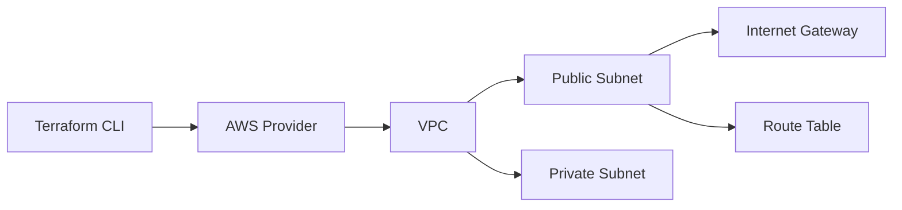

# Cloud Engineering & Security Portfolio

Hands-on cloud engineering portfolio focused on AWS infrastructure, identity security, and Infrastructure-as-Code using Terraform.

---

## Projects

---

### 1. IAM Security Baseline (Terraform)

**Overview**  
Implemented a least-privilege IAM identity model using Terraform to provision an AWS IAM user and attach a scoped S3 read-only policy. This demonstrates secure-by-default identity provisioning using Infrastructure-as-Code.

---

**Architecture**

Resources Deployed

IAM User: cloud-security-user
IAM Policy: S3ReadOnlyPolicy (S3 GetObject + ListBucket permissions)
IAM Policy Attachment (User → Policy binding)

Deployment Workflow

terraform init → provider initialization
terraform plan → change validation and drift detection
terraform apply → resource provisioning in AWS

Evidence of Deployment

Terraform Apply Output:

IAM User Created:

IAM Policy JSON:

**Security Design Principles**
- Least privilege IAM (only required S3 actions)
- No administrative or wildcard permissions
- Explicit resource-level policy scoping
- Infrastructure-as-Code enforced identity provisioning
- Fully reproducible Terraform deployments
---

### 2. VPC Network Architecture (Terraform)

**Overview**  
Designed and deployed a basic AWS VPC network using Terraform to demonstrate foundational cloud networking concepts, including subnet segmentation, routing control, and isolated infrastructure design.

---

**Architecture**

Resources Deployed

VPC with custom CIDR block
Public subnet (internet-accessible tier)
Private subnet (isolated workload tier)
Internet Gateway
Route table associations

Deployment Workflow

terraform init → provider initialization
terraform plan → validation of network changes
terraform apply → provisioning of VPC infrastructure

Evidence of Deployment

Terraform apply executed successfully 

VPC created and visible in AWS console

Subnets and routing tables properly associated

**Security Design Principles**
- Network segmentation between public and private tiers
- Controlled internet exposure via public subnet only
- Private subnet isolation from direct inbound access
- Explicit routing configuration (no implicit networking paths)
- Infrastructure-as-Code enforced network consistency

### 3. CI/CD Pipeline (Terraform Validation)

**Overview**
GitHub Actions pipeline for Terraform validation and infrastructure consistency checks on every commit and pull request.

**Pipeline Steps**
- terraform fmt — formatting validation
- terraform plan — execution dry run
- Automated checks triggered on every push

**Evidence**

GitHub Actions Workflow Run:

Workflow Success:

**Design Principles**
- Shift-left validation — catch errors before apply
- No manual intervention required for validation
- Consistent formatting enforced across all contributors

---

## Tools
AWS | Terraform | GitHub Actions | IAM | Cloud Networking

---

## Focus Areas
- Cloud Security Architecture
- Identity & Access Management
- Infrastructure as Code
- DevOps Security