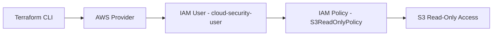
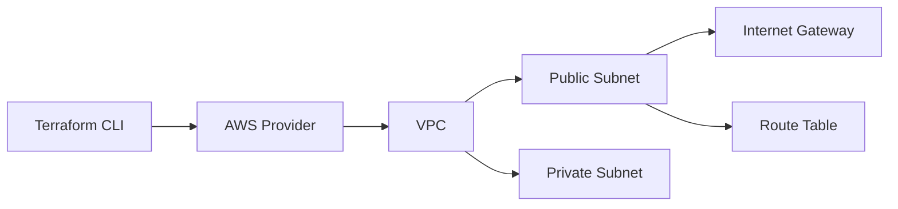
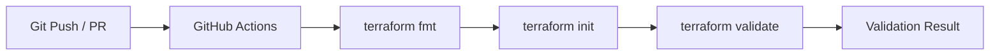

# Cloud Engineering & Security Portfolio

Production-style cloud engineering portfolio demonstrating AWS infrastructure design, identity security, and Infrastructure-as-Code automation using Terraform and GitHub Actions.

The repository focuses on secure-by-default architecture, reproducible deployments, and automated validation pipelines aligned with modern DevSecOps practices.

---

## Projects

---

### 1. IAM Security Baseline (Terraform)

**Overview**
Designed and deployed a least-privilege IAM model using Terraform to enforce secure identity provisioning in AWS. The architecture explicitly restricts access to S3 read-only operations, eliminating administrative access and wildcard permissions to follow least-privilege security principles.

**Architecture**

**Resources Provisioned**
- IAM User: cloud-security-user
- IAM Policy: S3ReadOnlyPolicy (explicit S3 GetObject + ListBucket access)
- IAM Policy Attachment (User to Policy binding)

**Deployment Workflow**
- terraform init — provider initialization and plugin resolution
- terraform plan — change validation and drift detection
- terraform apply — infrastructure provisioning in AWS

**Evidence of Deployment**

Terraform Execution:

IAM User Created:

IAM Policy Definition:

**Security Design Principles**
- Least privilege IAM access enforced at identity layer
- Explicit resource-level permission scoping (no wildcards)
- No administrative privileges assigned
- Infrastructure-as-Code enforced identity provisioning
- Fully reproducible and auditable deployments

---

### 2. VPC Network Architecture (Terraform)

**Overview**
Designed and deployed a modular AWS VPC network using Terraform to demonstrate secure cloud networking principles, including subnet segmentation, routing control, and workload isolation.

**Architecture**

**Resources Provisioned**
- VPC with custom CIDR block
- Public subnet (internet-facing tier)
- Private subnet (isolated workload tier)
- Internet Gateway
- Route table associations

**Deployment Workflow**
- terraform init — provider initialization
- terraform plan — network configuration validation
- terraform apply — infrastructure provisioning

**Evidence of Deployment**

Terraform Execution:

VPC Configuration:

Subnet Configuration:

Route Table Configuration:

**Security Design Principles**
- Network segmentation between public and private tiers
- Explicit routing control (no implicit internet access)
- Private subnet isolation from direct inbound exposure
- Controlled internet ingress via public subnet only
- Infrastructure-as-Code enforced network consistency

---

### 3. CI/CD Pipeline (Terraform Validation)

**Overview**
Implemented a GitHub Actions CI pipeline to automate Terraform validation checks on every commit and pull request. This pipeline enforces shift-left validation, ensuring infrastructure issues are detected before deployment.

**Pipeline Flow**

**Pipeline Stages**
- terraform fmt — formatting consistency enforcement
- terraform init — provider and dependency resolution
- terraform validate — configuration correctness validation

**Evidence of Execution**

CI Pipeline Run:

Successful Validation:

**Design Principles**
- Shift-left validation for infrastructure safety
- Automated enforcement of Terraform standards
- Stateless execution in ephemeral CI environments
- Consistent validation across all contributors
- Reproducible infrastructure testing pipeline

---

## Tools
AWS | Terraform | GitHub Actions | IAM | Cloud Networking

---

## Focus Areas
- Cloud Security Architecture
- Identity & Access Management (IAM)
- Infrastructure as Code (IaC)
- Secure Cloud Networking
- CI/CD Automation and Validation Pipelines