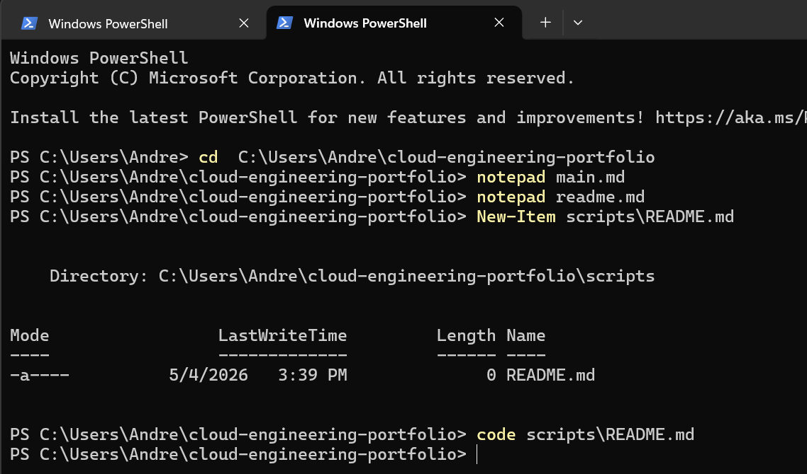

# Security Scripts

Python-based AWS security automation scripts for IAM auditing and access review.

---

## iam_audit.py

**Purpose**
Queries the AWS IAM API to list all users and their attached policies. Useful for identifying over-privileged identities and supporting least-privilege access reviews.

**Requirements**
- Python 3.x
- boto3 (`py -m pip install boto3`)
- AWS credentials configured via `aws configure`

**Usage**
py scripts/iam_audit.py

**Sample Output**

**Security Value**
- Supports rapid IAM access review
- Identifies users with no policies attached
- Detects inline vs managed policy usage
- Repeatable audit process via scripting